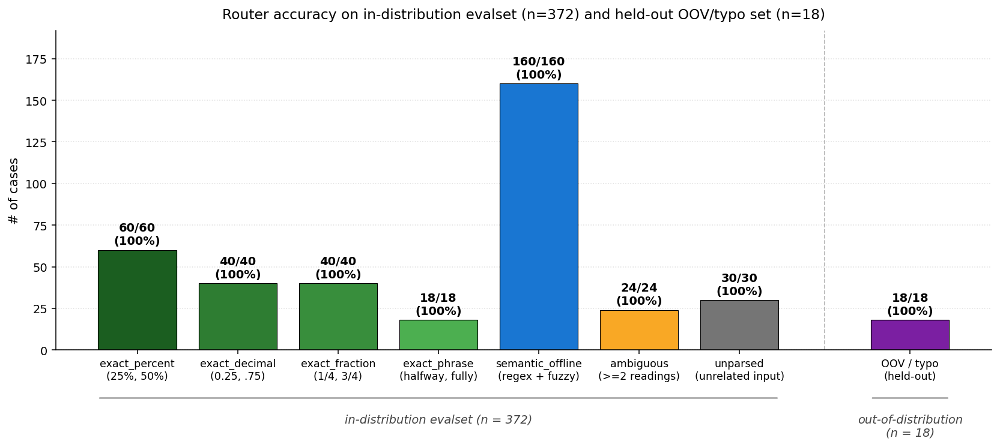
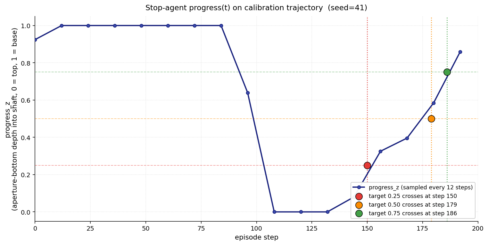

# VT-Refine-Lang-Fine-Manipulation

> Natural-language-driven fine-grained robotic insertion: a free-form English
> command lands the rim at one of three discrete depths (25 % / 50 % / 75 %)
> and the policy holds it there.

Built on top of [VT-Refine (NVlabs, CoRL 2025)](https://github.com/NVlabs/vt-refine)
for the 00581 nut-and-bolt asset on the ALOHA bimanual platform. Class project
deliverable; see `CONTRIBUTORS.md`.

If you use this work please cite both **this repository** and the **VT-Refine
paper**. Citation entries are in `CITATION.cff`.

---

## Pipeline at a glance
```
free-form English  ->  4-tier router  ->  target progress p*  ->  Phase 4 v3 stop agent  ->  rim holds at depth
("halfway", "litlle bitt", ...)        in {0.25, 0.50, 0.75}           (z-only progress formula)
```

Two contributions on top of upstream VT-Refine:

1. **`router/`** -- a 4-tier symbolic + semantic router that maps free-form
   natural-language instructions (including typos and idioms) to a single
   discrete depth target, with a deterministic priority ordering: numeric /
   exact-phrase -> regex anchors with fuzzy correction -> SBERT zero-shot ->
   explicit `fallback_unparsed`. Symbolic-first by design; the embedding
   tier is a backstop and the fallback returns a tagged 0.5 (not silent).
2. **`dppo_extensions/agent/eval/eval_diffusion_aperture_rim_stop_agent.py`**
   -- a z-only progress formula
   `progress_z = (shaft_top - aperture_bot) / (shaft_top - shaft_base)`,
   gated by a lateral admit and a lift gate, that triggers a hold the first
   time `progress_z >= target_progress`. No dependence on quaternion or
   mesh rotation. See `docs/stop_agent_physics.md` for derivation.

Why these two and not more: the upstream pipeline already handles the hard
parts (visuo-tactile diffusion policy + RL fine-tuning). What was missing
for a usable demo is a robust mapping from human language to a depth target
and a clean way to stop the policy mid-trajectory. Those are the two pieces
this repo adds.

---

## Demo highlights

Five end-to-end demos. Each animation below is the original mp4 sped up 6x
with a 2-second tail freeze on the final frame. Full-speed mp4s and the
end-frame stills are under `results/`.

### Three different inputs, all routed to the same 25 % goal

<table>
<tr>
<td align="center" width="33%">
  <br>
  <sub><b>"insert 25%"</b></sub><br>
  <sub><code>exact</code> -&gt; p* = 0.25</sub>
</td>
<td align="center" width="33%">
  <br>
  <sub><b>"insert a little bit"</b></sub><br>
  <sub><code>semantic_offline</code> -&gt; p* = 0.25</sub>
</td>
<td align="center" width="33%">
  <br>
  <sub><b>"insert a litlle bitt"</b> <i>(double typo)</i></sub><br>
  <sub>typo -&gt; fuzzy -&gt; <code>semantic_offline</code> -&gt; p* = 0.25</sub>
</td>
</tr>
</table>

### Different goals: 50 % vs 75 %

<table>
<tr>
<td align="center" width="50%">
  <br>
  <sub><b>"halfway"</b></sub><br>
  <sub><code>exact</code> -&gt; p* = 0.50</sub>
</td>
<td align="center" width="50%">
  <br>
  <sub><b>"most of the way"</b></sub><br>
  <sub><code>semantic_offline</code> -&gt; p* = 0.75</sub>
</td>
</tr>
</table>

The full-speed mp4s of all five demos plus a `routing_summary.md` table are
in `results/demos/`.

---

## Repository layout

- `router/` -- the 4-tier router (`route_instruction(text)`)
- `tests/` -- unit tests (`test_router.py`) and the OOV/typo regression
  (`test_router_typos.py`)
- `dppo_extensions/` -- four files that drop into the upstream `vt-refine/dppo/`
  tree at the same relative paths. Includes the Phase 4 v3 stop agent and
  the calibration logger / mesh inspector / progress analyzer used to
  derive the geometry constants
- `scripts/` -- driver shell scripts:
  - `run_with_text_command.sh` -- end-to-end driver: text -> router -> stop
    agent -> mp4
  - `run_aperture_rim_pipeline.sh` -- Phase 1->4 pipeline driver
  - `install_dppo_extensions.sh` -- drop the four `dppo_extensions/` files
    into a local clone of `vt-refine/`
- `results/` -- final deliverables (5 mp4 + 5 GIF + 3 PNG + metrics + 2
  charts + a per-folder README). Read `results/README.md` first
- `docs/` -- methodology / architecture / pitfalls / upstream-changes
  write-up

---

## Quantitative results

### Router

- **In-distribution evalset** (n = 372, string-level disjoint from unit
  tests): **372 / 372 = 100 %** accuracy. See
  `results/router_metrics/day14_router_evalset_metrics.json` and
  `results/router_metrics/day14_router_eval_report.md`.
- **Held-out OOV / typo set** (n = 18, includes double typos and idioms
  like `"shove it in just a hair"`): **18 / 18 = 100 %**. Reproduce with
  `python3 -m unittest tests.test_router_typos -v`. Raw stdout is in
  `results/router_metrics/18_case_oov_typo_result.txt`; case-by-case
  breakdown in `oov_typo_18cases.md`.
- **Unit tests** (`tests/test_router.py`): 9 / 9 pass.



### Stop agent

First-crossing steps on the calibration trajectory (seed = 41):

| Target depth | First-crossing step | Visual outcome |
|--------------|---------------------|----------------|
| 0.25 (shallow) | step **150** | rim sits on top, ~25 % engaged |
| 0.50 (mid)     | step **179** | rim mid-shaft, ~50 % engaged |
| 0.75 (deep)    | step **186** | rim near bottom, ~75 % engaged |

Detailed analysis and gate parameters are in
`results/stop_agent_metrics/first_crossing_steps.md` and the physics
derivation is in `docs/stop_agent_physics.md`.



---

## Reproducing the demos

This repo contains only our additions; the upstream simulator, ML stack,
and base policy are external dependencies. We do **not** ship checkpoints
or pretrain data.

1. Follow upstream [VT-Refine](https://github.com/NVlabs/vt-refine) install
   (Docker-based; pulls the simulator, diffusion policy, and AutoMate
   assets including 00581).
2. From this repo: `bash scripts/install_dppo_extensions.sh /path/to/vt-refine`.
   This drops the four `dppo_extensions/` files into the matching
   `dppo/agent/eval/` and `dppo/scripts/` paths.
3. From inside the upstream container, run the end-to-end driver:
```
ROUTER_SEMANTIC_BACKEND=auto bash scripts/run_with_text_command.sh "halfway"
```

   The driver routes the input text, calls the Phase 4 stop agent at the
   resulting target depth, and writes an mp4 under
   `log/aperture_rim_demo_videos/`.

A "class-project complete" reproducer is **not** the goal of this repo --
the goal is to make the source readable to a reviewer and to give the
demo speaker every artifact they need under `results/`.

---

## Methodology and design write-ups

In-depth documents live under `docs/`:

- `docs/methodology.md` -- the methodology summary used as the written
  companion to the in-class Methodology presentation
- `docs/system_architecture.md` -- how the router and stop agent compose
  end-to-end, with the dataflow and decision boundaries
- `docs/router_design.md` -- the 4-tier waterfall, priority rationale,
  fuzzy-correction details, and known limitations
- `docs/stop_agent_physics.md` -- z-only progress derivation, geometry
  constants for 00581, and the plug / socket naming convention
- `docs/known_pitfalls.md` -- a short list of non-obvious bugs we caught
  during development (kept short on purpose)
- `docs/upstream_changes.md` -- exactly which files we added or modified
  relative to upstream VT-Refine, satisfying the NVIDIA Source Code
  License modification-notice requirement

---

## License

This repository inherits the **NVIDIA Source Code License** from upstream
[NVlabs/vt-refine](https://github.com/NVlabs/vt-refine). See `LICENSE` for
the full text. Pretrain data referenced by upstream is licensed
**CC BY-NC 4.0** by NVIDIA. Both apply to derivative work and to this
repository.

## Acknowledgements

We thank the VT-Refine authors for releasing their pipeline, the AutoMate
data and asset providers (00581 in particular), and our course staff for
the project framing.
